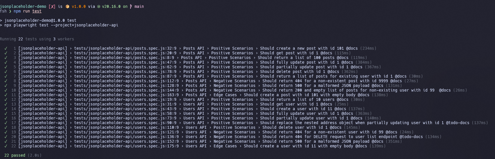

<!-- markdownlint-disable MD026 MD024 MD013 MD025 -->

# Disclaimer

This project is a result of a test assignment and serves as a proof-of-concept. It focuses on demonstrating a structured approach to API test automation rather than providing a production-ready solution.

# Playwright API Automation Framework

This repository contains an API testing framework built in JavaScript using [Playwright](https://playwright.dev/).
It is designed to test the endpoints of the public [JSONPlaceholder](https://jsonplaceholder.typicode.com) API. The framework is lightweight and maintainable, designed to be easily extendable, with well-structured test cases and comprehensive reporting.
It is optimized for CI/CD workflows and supports project-specific configuration.

## Table of Contents

- [Getting Started](#getting-started)
- [Running the Tests](#running-the-tests)
- [CI/CD (GitHub Actions)](<#ci%2Fcd-(github-actions)>)
- [Framework Considerations](#framework-considerations)
- [Project Structure](#project-structure)

## Getting Started

### Prerequisites

- Node.js (LTS version is recommended)

- npm (comes with Node.js)

### Playwright Installation and Project Setup

- Clone the repository:

```bash
git clone <repository_url>
```

- Navigate to the project directory:

```bash
cd <project_name>
```

- Install the required dependencies:

```bash
npm install
```

For more detailed installation instructions and options of the Playwright, please refer to the [Official Playwright Installation Guide](https://playwright.dev/docs/intro#installing-playwright).

## Running the Tests

To run the tests with the default configuration, use the following command:

```bash
npm run test
```

A successful test run will produce a console output similar to this:


To view the HTML report:

```bash
npm run html-report-open
```

You can also view a sample report from a previous test run, which is already included in this repository.

To run only documented tests (that has written test cases):

```bash
npm test:docs
```

To list all documented tests (that has written test cases):

```bash
npm test:list:docs
```

## CI/CD (GitHub Actions)

There is a single workflow that, besides basic triggers (push/pull_request), also runs at 00:00 on a cron schedule.

You can restrict test runs on specific days or exclude weekend nights by configuring `on.schedule` inside the workflow YAML.

Allure reports are also configured for CI/CD and available by link <https://typical-qaa.github.io/jsonplaceholder-demo/>

## Framework Considerations

This test framework is designed to handle some of the limitations of the JSONPlaceholder API. When you review or run these tests, please keep the following in mind:

- Static Nature: JSONPlaceholder is a fake API that doesn't save any new data or changes. It simply echoes the request payload with the appropriate status code, such as 201 Created for a POST request. The data is static and will not change over time.
- Limited Error Handling: The API does not consistently return standard 4xx or 5xx status codes for invalid requests. For example, malformed or empty JSON payloads will often result in a generic 500 Internal Server Error instead of a specific 400 Bad Request.
- No Authorization: The API does not require any authentication or authorization.
- PATCH Method Behavior: A PATCH request on a nested object will replace the entire object rather than partially updating individual fields.
- No Rate Limits: While a real-world API would have rate limits, JSONPlaceholder's request limits reset very frequently (every 1-5 seconds), making it difficult to test rate limit scenarios.
- No Validation or Sanitization: The API does not perform any validation on input data, such as a title that is too long, nor does it support data sanitization.

## Project Structure

This project follows a logical and modular structure to keep the test automation framework organized and maintainable.

### File Structure

- `docs/`: Contains the test case documentation in Markdown format.
- `data/`: Stores JSON files used for data-driven tests.
- `environment/`: Holds environment-specific configurations, including API endpoints and schema definitions.
- `routes/`: Contains a test API client with business logic for interacting with different API endpoints (posts, users, etc.).
- `support/`: Includes utility files for reusable functions, such as data generation, custom Playwright matchers, and constants.
- `tests/`: The core directory for all Playwright test specifications (.spec.js files).

### Design Notes

- The tests are structured using a pattern similar to the **Page Object Model (POM)**. This approach centralizes all API request logic in the `routes/` folder, which makes the tests themselves cleaner, more readable, and significantly easier to maintain.
- You can find a number of `NOTE` and `TODO` comments scattered throughout the code. These highlight specific considerations, potential future improvements, or areas for further investigation.
- The `playwright-report/` and `test-results/` directories are included in this repository to fulfill a specific assignment requirement. In a real-world project, it is considered a best practice to add those folders to the `.gitignore`.
